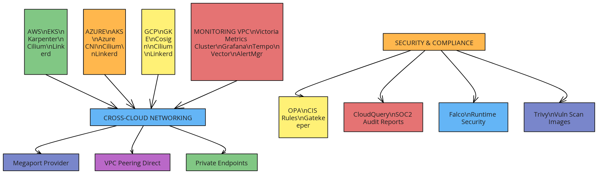

# 🌐 Multi-Cloud Kubernetes Infrastructure with Terraform

[](https://opensource.org/licenses/MIT)
[](https://www.terraform.io/)
[](https://aws.amazon.com/eks/)
[](https://azure.microsoft.com/en-us/services/kubernetes-service/)
[](https://cloud.google.com/kubernetes-engine)

> **Enterprise-grade multi-cloud Kubernetes infrastructure using 100% open-source tools**

A production-ready Terraform solution that deploys identical Kubernetes clusters across AWS EKS, Azure AKS, and Google GKE with unified observability, security, and compliance.

## 🎯 Why I Built This

### The Multi-Cloud Challenge

In today's enterprise landscape, organizations face several critical challenges:

- **Vendor Lock-in Risk**: Relying on a single cloud provider creates dependency and limits negotiation power
- **Regulatory Compliance**: Different regions and industries require data sovereignty across multiple clouds
- **Disaster Recovery**: True business continuity requires infrastructure spanning multiple cloud providers
- **Cost Optimization**: Multi-cloud strategies enable better pricing negotiations and resource optimization
- **Performance**: Deploying closer to users globally requires multi-cloud presence

### The Open-Source Imperative

Enterprise software licensing costs can spiral out of control. This project exclusively uses open-source tools to:

- **Eliminate License Fees**: No vendor lock-in or per-node licensing costs
- **Ensure Transparency**: Full visibility into all components and their behavior
- **Enable Customization**: Complete control over the infrastructure stack
- **Guarantee Longevity**: Open-source tools don't disappear due to business decisions

### Personal Motivation

As a DevOps engineer passionate about cloud-native technologies, I built this to solve real-world problems I've encountered:

- **Complexity Management**: Simplifying multi-cloud deployments through automation
- **Consistency**: Ensuring identical configurations across different cloud providers
- **Observability**: Creating unified monitoring across heterogeneous environments
- **Security**: Implementing defense-in-depth with policy-as-code

## 🏗️ Architecture Overview



*Comprehensive multi-cloud Kubernetes infrastructure spanning AWS EKS, Azure AKS, and Google GKE with unified observability, security, and cross-cloud networking.*

## 🛠️ How I Built It

### Technology Stack

#### **Infrastructure as Code**
- **Terraform 1.5+**: Multi-cloud resource provisioning
- **Terragrunt**: Environment management and DRY principles
- **Terraform Cloud**: State management and CI/CD integration

#### **Kubernetes Distributions**
- **AWS EKS**: Managed Kubernetes with Karpenter autoscaling
- **Azure AKS**: Managed Kubernetes with Azure CNI networking
- **Google GKE**: Managed Kubernetes with Cosign image signing

#### **Networking & Service Mesh**
- **Cilium**: eBPF-based CNI for high-performance networking
- **Linkerd**: Ultra-light service mesh for observability and security
- **Megaport**: Cross-cloud private connectivity

#### **Observability Stack**
- **VictoriaMetrics**: High-performance metrics storage
- **Grafana Tempo**: Distributed tracing backend
- **Vector**: High-performance log collection and routing
- **Alertmanager**: Multi-cloud alerting and notification routing

#### **Security & Compliance**
- **Open Policy Agent (OPA)**: Policy-as-code enforcement
- **Gatekeeper**: Kubernetes admission controller for OPA
- **CloudQuery**: Infrastructure security and compliance auditing
- **Falco**: Runtime security monitoring
- **Trivy**: Vulnerability scanning for containers and infrastructure

### Design Principles

#### **1. Cloud Agnostic Design**
```hcl
# Example: Cloud-agnostic cluster configuration
variable "clusters" {
  description = "Multi-cloud cluster configurations"
  type = map(object({
    provider     = string
    region       = string
    node_count   = number
    machine_type = string
    k8s_version  = string
  }))
  
  default = {
    aws_primary = {
      provider     = "aws"
      region       = "us-west-2"
      node_count   = 3
      machine_type = "m5.large"
      k8s_version  = "1.28"
    }
    azure_secondary = {
      provider     = "azure"
      region       = "West US 2"
      node_count   = 3
      machine_type = "Standard_D2s_v3"
      k8s_version  = "1.28"
    }
    gcp_tertiary = {
      provider     = "gcp"
      region       = "us-west1"
      node_count   = 3
      machine_type = "e2-standard-2"
      k8s_version  = "1.28"
    }
  }
}
```

#### **2. Infrastructure as Code Best Practices**
- **Modular Architecture**: Reusable Terraform modules for each cloud provider
- **State Management**: Remote state with locking and encryption
- **Version Control**: Git-based workflow with automated testing
- **Documentation**: Self-documenting code with comprehensive README files

#### **3. Security by Design**
- **Zero Trust Networking**: All communication encrypted and authenticated
- **Policy as Code**: Automated compliance checking and enforcement
- **Least Privilege**: Minimal IAM permissions and RBAC policies
- **Supply Chain Security**: Image signing and vulnerability scanning

#### **4. Operational Excellence**
- **Unified Observability**: Single pane of glass for multi-cloud monitoring
- **Automated Remediation**: Self-healing infrastructure with automated responses
- **Disaster Recovery**: Cross-cloud backup and failover capabilities
- **Cost Optimization**: Resource right-sizing and automated scaling

## 🎯 Use Cases

### 1. **Enterprise Multi-Cloud Strategy**
**Scenario**: Large enterprise needs to avoid vendor lock-in while maintaining consistent operations across clouds.

**Solution**: Deploy identical Kubernetes clusters across AWS, Azure, and GCP with unified management and monitoring.

**Benefits**:
- Reduced vendor dependency
- Improved negotiation position
- Consistent operational procedures
- Simplified disaster recovery

### 2. **Regulatory Compliance & Data Sovereignty**
**Scenario**: Financial services company must keep data in specific geographic regions while maintaining global operations.

**Solution**: Deploy clusters in required regions across different cloud providers with policy enforcement.

**Benefits**:
- Automated compliance checking
- Geographic data placement control
- Audit trail and reporting
- Risk mitigation

### 3. **High Availability & Disaster Recovery**
**Scenario**: E-commerce platform requires 99.99% uptime with automatic failover capabilities.

**Solution**: Active-active deployment across multiple clouds with automated traffic routing.

**Benefits**:
- Zero-downtime deployments
- Automatic failover
- Geographic load distribution
- Business continuity assurance

### 4. **Development & Testing Environments**
**Scenario**: Development teams need consistent environments across different clouds for testing and validation.

**Solution**: Automated provisioning of identical clusters for development, staging, and production.

**Benefits**:
- Environment consistency
- Rapid provisioning
- Cost optimization
- Testing reliability

### 5. **Hybrid Cloud Migration**
**Scenario**: Organization migrating from on-premises to cloud needs gradual transition strategy.

**Solution**: Phased migration with consistent tooling and processes across environments.

**Benefits**:
- Reduced migration risk
- Skill reusability
- Consistent operations
- Flexible timeline

## 🚀 Getting Started

### Prerequisites

```bash
# Required tools
terraform >= 1.5.0
terragrunt >= 0.50.0
kubectl >= 1.28.0
helm >= 3.12.0
python >= 3.9.0

# Cloud CLI tools
aws-cli >= 2.0.0
azure-cli >= 2.50.0
gcloud >= 400.0.0
```

### 🛠️ Tool Installation

**Option 1: Automated Installation (Ubuntu/Debian)**
```bash
# Quick setup - installs all required tools
./install-tools.sh
```

**Option 2: Manual Installation**
```bash
# Install Terraform
wget -O- https://apt.releases.hashicorp.com/gpg | sudo gpg --dearmor -o /usr/share/keyrings/hashicorp-archive-keyring.gpg
echo "deb [signed-by=/usr/share/keyrings/hashicorp-archive-keyring.gpg] https://apt.releases.hashicorp.com $(lsb_release -cs) main" | sudo tee /etc/apt/sources.list.d/hashicorp.list
sudo apt update && sudo apt install terraform

# Install Terragrunt
wget https://github.com/gruntwork-io/terragrunt/releases/download/v0.50.17/terragrunt_linux_amd64
chmod +x terragrunt_linux_amd64 && sudo mv terragrunt_linux_amd64 /usr/local/bin/terragrunt

# Install kubectl
curl -LO "https://dl.k8s.io/release/$(curl -L -s https://dl.k8s.io/release/stable.txt)/bin/linux/amd64/kubectl"
chmod +x kubectl && sudo mv kubectl /usr/local/bin/

# Install cloud CLIs
curl "https://awscli.amazonaws.com/awscli-exe-linux-x86_64.zip" -o "awscliv2.zip" && unzip awscliv2.zip && sudo ./aws/install
curl -sL https://aka.ms/InstallAzureCLIDeb | sudo bash
sudo apt-get install google-cloud-cli
```

## 📋 Step-by-Step Implementation Scenarios

### 🎯 Scenario 1: Complete Multi-Cloud Production Deployment

**Use Case**: Enterprise production environment across all three clouds

**Step 1: Initial Setup**
```bash
# Clone repository
git clone https://github.com/nguie2/terraform-multicloud-eks-aks-gke.git
cd terraform-multicloud-eks-aks-gke

# Install tools (if not done)
./install-tools.sh
```

**Step 2: Cloud Authentication**
```bash
# AWS Authentication
aws configure
# Enter: Access Key ID, Secret Access Key, Region (us-west-2), Output format (json)

# Azure Authentication
az login
# Follow browser authentication flow
az account set --subscription "your-subscription-id"

# GCP Authentication
gcloud auth login
# Follow browser authentication flow
gcloud config set project YOUR_PROJECT_ID
gcloud services enable container.googleapis.com compute.googleapis.com
```

**Step 3: Environment Configuration**
```bash
# Set required environment variables
export TF_VAR_gcp_project_id="your-production-project"
export TF_VAR_megaport_access_key="your-megaport-key"  # Optional for cross-cloud networking
export TF_VAR_megaport_secret_key="your-megaport-secret"  # Optional

# Verify authentication
aws sts get-caller-identity
az account show
gcloud auth list
```

**Step 4: Infrastructure Deployment**
```bash
# Validate prerequisites
./scripts/deploy.sh prod --validate-only

# Review deployment plan
./scripts/deploy.sh prod --plan-only

# Deploy to production
./scripts/deploy.sh prod

# Expected output:
# ✅ AWS EKS cluster deployed
# ✅ Azure AKS cluster deployed  
# ✅ GCP GKE cluster deployed
# ✅ Cross-cloud networking configured
# ✅ Monitoring stack deployed
# ✅ Security policies applied
```

**Step 5: Validation & Testing**
```bash
# Run cluster parity validation
python3 scripts/validate_cluster_parity.py

# Configure kubectl contexts
aws eks update-kubeconfig --region us-west-2 --name multicloud-k8s-prod-aws
az aks get-credentials --resource-group multicloud-k8s-prod-azure-rg --name multicloud-k8s-prod-azure
gcloud container clusters get-credentials multicloud-k8s-prod-gcp --region us-west1

# Verify cluster connectivity
kubectl get nodes --context multicloud-k8s-prod-aws
kubectl get nodes --context multicloud-k8s-prod-azure
kubectl get nodes --context multicloud-k8s-prod-gcp

# Check security components
kubectl get violations --all-namespaces --context multicloud-k8s-prod-aws
kubectl get pods -n falco --context multicloud-k8s-prod-aws
```

### 🎯 Scenario 2: Single Cloud Development Environment

**Use Case**: Development environment on AWS only

**Implementation:**
```bash
# Deploy only AWS EKS
./scripts/deploy.sh dev --aws-only

# Configure kubectl
aws eks update-kubeconfig --region us-west-2 --name multicloud-k8s-dev-aws

# Verify deployment
kubectl get nodes
kubectl get pods --all-namespaces
```

### 🎯 Scenario 3: Gradual Multi-Cloud Migration

**Use Case**: Start with one cloud, gradually add others

**Phase 1: AWS Foundation**
```bash
# Deploy AWS infrastructure first
./scripts/deploy.sh prod --aws-only

# Validate AWS deployment
kubectl get nodes --context multicloud-k8s-prod-aws
```

**Phase 2: Add Azure**
```bash
# Deploy Azure infrastructure
./scripts/deploy.sh prod --azure-only

# Configure cross-cloud networking
terragrunt run-all apply -target=module.cross_cloud_networking
```

**Phase 3: Add GCP**
```bash
# Deploy GCP infrastructure
./scripts/deploy.sh prod --gcp-only

# Complete cross-cloud setup
terragrunt run-all apply
```

### 🎯 Scenario 4: Disaster Recovery Setup

**Use Case**: Primary region failure, failover to secondary cloud

**Setup:**
```bash
# Deploy with specific region configuration
export TF_VAR_aws_region="us-west-2"
export TF_VAR_azure_location="West US 2"
export TF_VAR_gcp_region="us-west1"

./scripts/deploy.sh prod

# Configure backup and replication
kubectl apply -f configs/disaster-recovery/
```

**Failover Process:**
```bash
# Switch traffic to secondary cloud
kubectl patch service app-service -p '{"spec":{"selector":{"cloud":"azure"}}}'

# Verify failover
kubectl get endpoints app-service
```

### 🎯 Scenario 5: Compliance-First Deployment

**Use Case**: Highly regulated environment requiring SOC2/CIS compliance

**Implementation:**
```bash
# Deploy with enhanced security
export TF_VAR_enable_opa_gatekeeper=true
export TF_VAR_enable_falco=true
export TF_VAR_enable_trivy=true

./scripts/deploy.sh prod

# Generate compliance report
./modules/compliance/generate-compliance-report.sh

# Review compliance status
kubectl get violations --all-namespaces
kubectl get vulnerabilityreports --all-namespaces
```

### 🎯 Scenario 6: Cost-Optimized Development

**Use Case**: Minimal cost development environment

**Implementation:**
```bash
# Deploy with cost optimization
export TF_VAR_node_count=1
export TF_VAR_enable_spot_instances=true

./scripts/deploy.sh dev

# Monitor costs
aws ce get-cost-and-usage --time-period Start=2024-01-01,End=2024-01-31 --granularity MONTHLY --metrics BlendedCost
```

### 🎯 Scenario 7: High-Performance Computing

**Use Case**: GPU workloads requiring high-performance networking

**Implementation:**
```bash
# Deploy with GPU nodes
export TF_VAR_enable_gpu_nodes=true
export TF_VAR_instance_types='["p3.2xlarge", "Standard_NC6s_v3", "n1-standard-4"]'

./scripts/deploy.sh prod

# Deploy GPU workload
kubectl apply -f examples/gpu-workload.yaml
```

## 🔧 Advanced Configuration

### Custom Network Configuration
```bash
# Custom VPC CIDRs
export TF_VAR_vpc_cidr='{"aws":"10.0.0.0/16","azure":"10.1.0.0/16","gcp":"10.2.0.0/16"}'

# Custom Kubernetes versions
export TF_VAR_kubernetes_version="1.29"
```

### Security Hardening
```bash
# Enable all security features
export TF_VAR_enable_opa_gatekeeper=true
export TF_VAR_enable_falco=true
export TF_VAR_enable_trivy=true
export TF_VAR_enable_network_policies=true
export TF_VAR_enable_pod_security_standards=true
```

### Monitoring Configuration
```bash
# Custom monitoring setup
export TF_VAR_enable_victoria_metrics=true
export TF_VAR_enable_grafana_tempo=true
export TF_VAR_enable_vector=true
export TF_VAR_monitoring_retention_days=30
```

## 🚨 Troubleshooting Common Issues

### Authentication Issues
```bash
# AWS credential issues
aws sts get-caller-identity
aws configure list

# Azure authentication problems
az account show
az login --use-device-code

# GCP authentication issues
gcloud auth list
gcloud auth application-default login
```

### Terraform State Issues
```bash
# State lock issues
terragrunt force-unlock LOCK_ID

# State corruption
terragrunt state pull > backup.tfstate
terragrunt import aws_instance.example i-1234567890abcdef0
```

### Kubernetes Connectivity
```bash
# Update kubeconfig
aws eks update-kubeconfig --region us-west-2 --name cluster-name
az aks get-credentials --resource-group rg-name --name cluster-name
gcloud container clusters get-credentials cluster-name --region us-west1

# Debug connectivity
kubectl cluster-info
kubectl get nodes -o wide
kubectl get pods --all-namespaces
```

## 📊 Monitoring & Validation

### Health Checks
```bash
# Cluster health
kubectl get nodes
kubectl get pods --all-namespaces | grep -v Running

# Security status
kubectl get violations --all-namespaces
kubectl get networkpolicies --all-namespaces

# Performance metrics
kubectl top nodes
kubectl top pods --all-namespaces
```

### Automated Validation
```bash
# Run comprehensive validation
python3 scripts/validate_cluster_parity.py --verbose

# Generate deployment report
./scripts/deploy.sh prod --generate-report

# Compliance audit
./modules/compliance/generate-compliance-report.sh
```

## 📊 Monitoring & Observability

### Metrics Collection
- **VictoriaMetrics**: High-performance metrics storage with PromQL compatibility
- **Node Exporter**: System-level metrics collection
- **kube-state-metrics**: Kubernetes object metrics
- **Custom Metrics**: Application-specific metrics via Prometheus client libraries

### Distributed Tracing
- **Grafana Tempo**: Scalable distributed tracing backend
- **OpenTelemetry**: Vendor-neutral instrumentation
- **Jaeger**: Trace visualization and analysis

### Log Management
- **Vector**: High-performance log collection and routing
- **Structured Logging**: JSON-formatted logs with consistent schema
- **Log Aggregation**: Centralized logging across all clusters

### Alerting
- **Alertmanager**: Multi-cloud alert routing and notification
- **Runbook Automation**: Automated response to common issues
- **Escalation Policies**: Tiered alerting based on severity

## 🔒 Security & Compliance

### Policy as Code
```yaml
# Example OPA policy for CIS compliance
package kubernetes.admission

deny[msg] {
  input.request.kind.kind == "Pod"
  input.request.object.spec.securityContext.runAsRoot == true
  msg := "Containers must not run as root user"
}

deny[msg] {
  input.request.kind.kind == "Pod"
  not input.request.object.spec.securityContext.readOnlyRootFilesystem
  msg := "Containers must use read-only root filesystem"
}
```

### Compliance Frameworks
- **CIS Kubernetes Benchmark**: Automated security configuration validation
- **SOC 2**: Infrastructure auditing and reporting
- **PCI DSS**: Payment card industry compliance checks
- **GDPR**: Data protection and privacy controls

### Runtime Security
- **Falco**: Real-time threat detection and response
- **Network Policies**: Micro-segmentation and traffic control
- **Pod Security Standards**: Kubernetes-native security controls
- **Image Scanning**: Vulnerability assessment for container images

## 🧪 Testing & Validation

### Infrastructure Testing
```python
# Example cluster parity validation
import subprocess
import json
from typing import Dict, List

def validate_cluster_parity():
    """Validate that all clusters have identical configurations"""
    clusters = get_cluster_configs()
    
    for cluster_name, config in clusters.items():
        print(f"Validating {cluster_name}...")
        
        # Check node count
        assert_node_count(cluster_name, config['expected_nodes'])
        
        # Check Kubernetes version
        assert_k8s_version(cluster_name, config['k8s_version'])
        
        # Check installed components
        assert_components_installed(cluster_name, config['components'])
        
        print(f"✅ {cluster_name} validation passed")

def assert_node_count(cluster: str, expected: int):
    """Verify cluster has expected number of nodes"""
    result = subprocess.run([
        'kubectl', '--context', cluster, 
        'get', 'nodes', '-o', 'json'
    ], capture_output=True, text=True)
    
    nodes = json.loads(result.stdout)
    actual = len(nodes['items'])
    
    assert actual == expected, f"Expected {expected} nodes, got {actual}"
```

### Automated Testing Pipeline
- **Unit Tests**: Terraform module validation
- **Integration Tests**: Cross-cloud connectivity verification
- **Security Tests**: Policy compliance validation
- **Performance Tests**: Load testing and benchmarking

## 📈 Performance & Optimization

### Resource Optimization
- **Karpenter**: Just-in-time node provisioning for AWS EKS
- **Cluster Autoscaler**: Automatic scaling for Azure AKS and Google GKE
- **Vertical Pod Autoscaler**: Right-sizing container resource requests
- **Horizontal Pod Autoscaler**: Application-level scaling based on metrics

### Network Performance
- **Cilium eBPF**: High-performance networking with kernel bypass
- **Network Policies**: Efficient traffic filtering at the kernel level
- **Load Balancing**: Intelligent traffic distribution across clusters
- **CDN Integration**: Edge caching for improved user experience

### Cost Management
- **Spot Instances**: Cost-effective compute for non-critical workloads
- **Reserved Instances**: Long-term cost savings for predictable workloads
- **Resource Tagging**: Detailed cost allocation and chargeback
- **Automated Cleanup**: Removal of unused resources

## 🔄 CI/CD Integration

### GitOps Workflow
```yaml
# Example GitHub Actions workflow
name: Multi-Cloud Infrastructure

on:
  push:
    branches: [main]
  pull_request:
    branches: [main]

jobs:
  validate:
    runs-on: ubuntu-latest
    steps:
      - uses: actions/checkout@v3
      
      - name: Setup Terraform
        uses: hashicorp/setup-terraform@v2
        with:
          terraform_version: 1.5.0
          
      - name: Terraform Validate
        run: |
          cd modules/aws-eks
          terraform init
          terraform validate
          
      - name: Security Scan
        uses: aquasecurity/trivy-action@master
        with:
          scan-type: 'config'
          scan-ref: '.'
          
  deploy:
    needs: validate
    runs-on: ubuntu-latest
    if: github.ref == 'refs/heads/main'
    steps:
      - name: Deploy Infrastructure
        run: |
          terragrunt run-all apply --terragrunt-non-interactive
```

### Deployment Strategies
- **Blue-Green Deployments**: Zero-downtime application updates
- **Canary Releases**: Gradual rollout with automated rollback
- **Feature Flags**: Runtime configuration without code changes
- **Progressive Delivery**: Risk-minimized deployment patterns

## 🤝 Contributing

I welcome contributions from the community! Here's how you can help:

### Development Setup
```bash
# Fork and clone the repository
git clone https://github.com/YOUR_USERNAME/terraform-multicloud-eks-aks-gke.git
cd terraform-multicloud-eks-aks-gke

# Create a feature branch
git checkout -b feature/your-feature-name

# Make your changes and test
terragrunt run-all plan

# Submit a pull request
git push origin feature/your-feature-name
```

### Contribution Guidelines
- Follow Terraform best practices and style guidelines
- Include comprehensive documentation for new features
- Add tests for all new functionality
- Ensure security and compliance requirements are met
- Update the README with any new capabilities

## 📚 Documentation

### Additional Resources
- [Terraform Module Documentation](./docs/terraform-modules.md)
- [Security Configuration Guide](./docs/security-guide.md)
- [Troubleshooting Guide](./docs/troubleshooting.md)
- [Performance Tuning Guide](./docs/performance-tuning.md)
- [Cost Optimization Guide](./docs/cost-optimization.md)

### Architecture Decision Records
- [ADR-001: Multi-Cloud Strategy](./docs/adr/001-multi-cloud-strategy.md)
- [ADR-002: Open Source Tool Selection](./docs/adr/002-open-source-tools.md)
- [ADR-003: Networking Architecture](./docs/adr/003-networking-architecture.md)
- [ADR-004: Security Framework](./docs/adr/004-security-framework.md)

## 🎖️ Achievements & Recognition

This project demonstrates enterprise-level infrastructure engineering capabilities:

- **Multi-Cloud Expertise**: Deep understanding of AWS, Azure, and GCP services
- **Infrastructure as Code**: Advanced Terraform and Terragrunt implementation
- **Security Engineering**: Comprehensive security and compliance framework
- **DevOps Excellence**: Complete CI/CD pipeline with automated testing
- **Open Source Advocacy**: 100% open-source tool selection and contribution

## 📞 Connect With Me

**Nguie Angoue Jean Roch Junior**  
*DevOps Engineer & Cloud Architect*

- 📧 Email: [nguierochjunior@gmail.com](mailto:nguierochjunior@gmail.com)
- 🐦 Twitter: [@jean32529](https://x.com/jean32529)
- 💼 LinkedIn: [nguie-angoue-j-2b2880254](https://www.linkedin.com/in/nguie-angoue-j-2b2880254/)
- 🐙 GitHub: [@nguie2](https://github.com/nguie2)

---

## 📄 License

This project is licensed under the MIT License - see the [LICENSE](LICENSE) file for details.

## 🙏 Acknowledgments

- The Kubernetes community for building amazing open-source tools
- HashiCorp for Terraform and the infrastructure-as-code movement
- The CNCF for fostering cloud-native innovation
- All contributors who help make this project better

---

*Built with ❤️ for the cloud-native community*